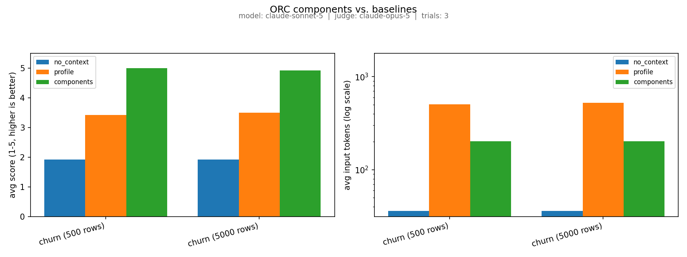

<p align="center">
  
</p>

[](LICENSE)

**OpenReasoningComponents (ORC) is an open standard for knowledge components that integrate directly into LLM reasoning, enabling more grounded and compositional inference.**

---

## Why OpenReasoningComponents?

The knowledge LLMs need to reason over typically originates somewhere else: a database, a document corpus, a trained model, an expert's judgment, etc. Getting those components of knowledge into the reasoning process is harder than it should be. Common approaches (SQL pipelines, embedding raw tables or documents into prompts, attaching CSVs, etc.) are inefficient, opaque, and brittle.

**OpenReasoningComponents** introduces a compression layer between the source material and the LLM reasoning:

```
sources  ╲                                       ╱  reasoning
            ╲                                 ╱
               ╲                           ╱
                  ╲──── components ────╱
               ╱                           ╲
            ╱                                 ╲
         ╱                                       ╲
```

A **component** is a single, self-contained piece of knowledge — a fact, relationship, or rule — expressed in natural language and backed by structured evidence. Components are designed to be composed into prompts and woven into chains of thought. They work through any standard LLM API, with no file uploads or special tooling required.

<details>
<summary><strong>Accuracy vs Correctness</strong></summary>

An important distinction is worth being explicit about: accurately computing a number and that number being a useful insight is not the same thing. **OpenReasoningComponents** specifies how to present a component of reasoning to an LLM, **not** whether that component of reasoning correctly answers the question. Correctness is the responsibility of whatever system produces or consumes a component.

What ORC standardizes is the *form* of a component: a statement that carries its own `evidence` and `provenance` (see the [schema](spec/component.md#component-schema)), so a consumer can see what backs a claim instead of taking a bare number on faith. A good producer does the checking before it ever emits a component; a bad one can emit a confidently wrong one just as easily as a bad SQL query can return one. The spec constrains the *shape* of a trustworthy claim, not whether any particular claim is true.

</details>

### What happens when ORC is used?

Does grounding an LLM's answer in verified components produce better answers, more cheaply, than giving it raw data access instead? Here's a quick example testing three conditions: no context at all, a realistic data profile (schema, summary statistics, and a small sample of rows), and ORC components. On a synthetic customer-churn dataset, `claude-sonnet-5` answering and `claude-opus-5` judging (a different model, so no same-model self-preference bias):

<p align="center">
  
</p>

In this example, Sonnet reasoning over ORC components scored 5.00 and 4.92 out of 5, at 500 and 5,000 rows, against 3.42 and 3.50 for the profile baseline and 1.92 for no context at all -- on less than half the profile baseline's tokens. Full methodology, caveats, and how to reproduce it are under [Examples](#examples) below.

---

## What Does It Look Like?

A component:

```json
{
  "id": "intelligible/churn_discount_threshold",
  "type": "threshold_rule",
  "scope": { "source": "customer_churn" },
  "statement": "Customers receiving discounts above 20% churn substantially more often.",
  "relations": [
    { "type": "depends_on", "target_id": "intelligible/customers_discount" },
    { "type": "depends_on", "target_id": "intelligible/customers_churn" }
  ],
  "structure": {
    "feature": "discount",
    "threshold": 0.20,
    "direction": "above"
  },
  "evidence": {
    "odds_ratio": 1.7,
    "sample_size": 4821
  }
}
```

Components composed into a reasoning prompt. For example, your system could compose a prompt like:

```
You are analyzing customer churn for the customer_churn dataset.

The following facts are known:

- discount is a float column in the customers table representing the
  discount rate applied to a customer's contract, ranging from 0% to 35%.
- Customer discounts range from 0% to 35%, with a median of 12%.
- Customers receiving discounts above 20% churn substantially more often.
- Tenure has a nonlinear protective effect on churn, strongest in the
  first 12 months.

Given these facts, which customers should be prioritized for a retention
campaign?
```

In this example, each bullet was a component's `statement`. The LLM then reasons over natural language grounded in source-derived evidence — no raw data needed.

---

## Quickstart

Generate components from the Iris dataset, build a prompt, and evaluate:

```bash
pip install scikit-learn scipy anthropic

# generate components from sklearn's Iris dataset
python examples/generate.py -o examples/components.json

# read components and build a prompt
python examples/prompt.py examples/components.json

# compare AI reasoning: no context vs. a realistic data profile vs. components
export ANTHROPIC_API_KEY=sk-ant-...
python examples/eval.py --dataset iris --judge
```

---

## Specification

See [spec/component.md](spec/component.md), backed by a machine-readable
[JSON Schema](spec/component.schema.json) and a fixture-based
[conformance suite](spec/tests/) (`pytest spec/tests/`).

Or skip straight to the checked-in [examples/components.json](examples/components.json) to see the format used in an example.

See [CHANGELOG.md](CHANGELOG.md) for what's changed.

---

## Examples

- [examples/generate.py](examples/generate.py) — produces components from the Iris example dataset
- [examples/prompt.py](examples/prompt.py) — reads components and composes a reasoning prompt
- [examples/eval.py](examples/eval.py) — compares AI reasoning with components vs. a realistic data profile vs. no context (a full-CSV-dump condition also exists, via `--include-raw-dump`, as an explicit naive upper bound, not the default); `--chart`/`--results-json` save a reproducible PNG and the raw numbers from a real run
- [examples/components.json](examples/components.json) — components generated from the Iris example dataset; generated by [generate.py](examples/generate.py).

### eval.py's churn benchmark, in full

The Iris comparison in Quickstart is a 150-row toy: fine for seeing the
format, too small to say anything about components at scale. `eval.py` also
runs a sturdier version against a synthetic customer-churn dataset --
generated and turned into components entirely within the script, no external
system required -- at more than one size, so the "components stay small as
data grows" claim behind the [What happens when ORC is used?](#what-happens-when-orc-is-used) numbers above
can actually be measured, not just shown once. The baseline it's compared
against is `profile`: a schema, summary statistics, and a small random
sample of rows -- the shape of context a `df.describe()` + `df.sample()`
step, or a lightweight BI-copilot, would actually send. That's the fair "the
agent looked at the data itself" comparison; a full-CSV-dump condition also
exists (`--include-raw-dump`) as an explicit naive upper bound, not the
headline number.

```bash
python examples/eval.py --dry-run --sizes 500 5000   # no API key needed -- just the sizing
```

`--dry-run` confirms the sizing claim with no API key: at 500 rows,
`profile` runs ~1,071 characters (schema + stats + a fixed 8-row sample)
against ~565 for `components`; at 5,000 rows `profile` is still only ~1,101
characters (schema and stats are computed once, and the sample size doesn't
grow with the dataset), while `--include-raw-dump`'s full-dump condition
runs ~19.5k at 500 rows and ~197k at 5,000 -- one line per row, every time.
`profile` and `components` are both close to flat as the dataset grows; the
real difference between them isn't raw context size, it's what the numbers
mean by the time they reach the model -- a sample and some summary
statistics still ask the model to do the reasoning itself (is a 22% churn
rate high? which segment is actually risky?), where a component states the
answer directly (customers over 20% discount churn ~6x more often) as a fact
the model can just read.

The chart in [What happens when ORC is used?](#what-happens-when-orc-is-used) is the result of a live, judged
run: `claude-sonnet-5` answering, `claude-opus-5` judging, 4 questions x 3
trials x 2 sizes. `eval_results.json` alongside the image has the exact
numbers. Reproduce or extend it yourself:

```bash
pip install matplotlib   # only needed for --chart
python examples/eval.py --sizes 500 5000 --trials 3 --judge \
    --judge-model <a different model> \
    --chart eval_results.png --results-json eval_results.json
```

Pass `--dataset iris` for the original, 150-row, single-size demo.

---

## Contributing

OpenReasoningComponents is an open standard. Contributions and design discussions are welcome. Please open issues or proposals in the repository.
